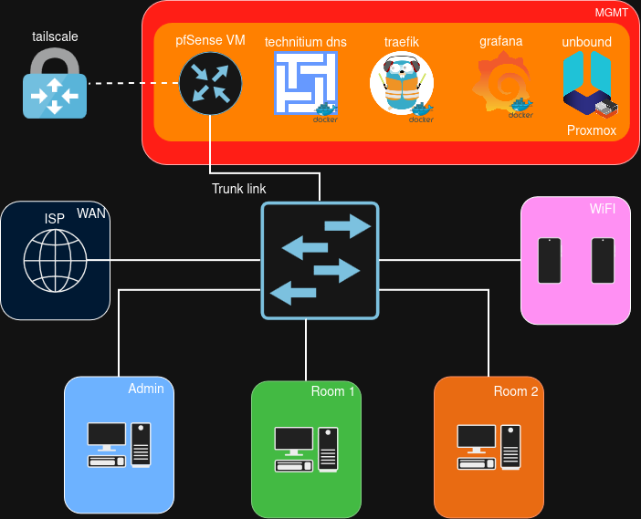
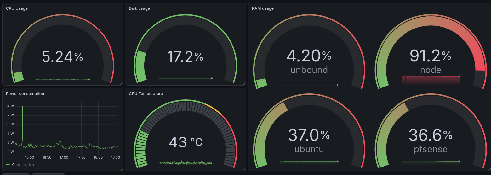
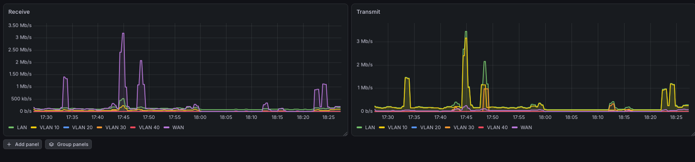

# My homelab
This repository documents my homelab based on Proxmox VE, pfSense and Docker.

## Table of contents

* [Networking](#networking)
  * [Diagram](#diagram)
  * [VLANs and subnetting](#vlans-and-subnetting)
  * [Firewall](#firewall)
  * [DNS](#dns)
* [Proxmox](#proxmox)
  * [Hardware](#hardware)
  * [Virtual machines and containers](#virtual-machines-and-containers)
  * [Backup](#backup)
* [Services](#services)
* [Monitoring and alerts](#monitoring-and-alerts)
  * [Dashboard](#dashboard)
  * [Alerts](#alerts)

## Networking
### Diagram

### VLANs and subnetting

| id  | Title  | Subnet           |
| --- | ------ | ---------------- |
| 10  | Admin  | 192.168.10.0/24  |
| 20  | Room 1 | 192.168.20.0/24  |
| 30  | Room 2 | 192.168.30.0/24  |
| 40  | WiFI   | 192.168.40.0/24  |
| 99  | MGMT   | 192.168.99.0/24  |
| 100 | WAN    | 192.168.100.0/24 |
### Firewall

| From \ To       | MGMT     | Admin | Room 1/2 | WiFI | Internet |
| --------------- | -------- | ----- | -------- | ---- | -------- |
| Admin           | ✔        | -     | ✔        | ✔    | ✔        |
| Room 1/2        | DNS only | ✘     | ✘        | ✘    | ✔        |
| WiFI            | DNS only | ✘     | ✘        | -    | ✔        |
| VPN (Tailscale) | ✔        | ✘     | ✘        | ✘    | ✔        |
### DNS
The primary DNS is based on Technitium, unning in the Docker. The backup is Unbound, running in Alpine LXC container. [unbound.conf](unbound/unbound.conf)

To automate creation of DNS records, I wrote a Python script [dns-sync](docker/dns-sync/sync.py), which reads router rules from Traefik and creates records through the Technitium API.

## Services

| Service | Description | Compose File |
|---------|-------------|--------------|
| **Portainer** | Web UI for Docker management | [Compose](docker/portainer.yaml) |
| **Traefik** | Reverse proxy. ACME configured with Cloudflare | [Compose](docker/traefik/compose.yaml) |
| **Technitium** | DNS server. Configured to block adware and malware | [Compose](docker/technitium.yaml) |
| **Grafana and VictoriaMetrics** | Monitoring stack based on Grafana, Loki, Alloy and VictoriaMetrics | [Compose](docker/monitoring/compose.yaml) |
| **n8n** | No code automation tool | [Compose](docker/n8n.yaml) |
| **dns-sync** | DNS records automation | [Compose](docker/dns-sync/compose.yaml) |

## Proxmox
### Hardware
**Xiaomi Notebook Pro 2019**
- Intel i5-8250U 1.60GHz 4 cores / 8 threads
- 8GB RAM
- 256 GB SSD

**Second node**
- Ryzen 5 1400 3.20GHz 4 cores / 8 threads
- 16GB RAM
- 512 GB SSD
- 1024 GB HDD
- Purpose: backups only
### Virtual machines and containers
- pfSense (VM)
- Ubuntu (VM)
- Alpine (LXC)
- PBS (LXC) (second node)
### Backup
Backups are made with Proxmox Backup Server (PBS) everyday and stored on the second node.
It retains one daily, one weekly and one monthly backups.
## Monitoring and alerts
The monitoring is based on Grafana (Grafana, Alloy, Loki) and VictoriaMetrics.
### Dashboard
Metrics from Proxmox, virtual machines and LXC containers.

Metrics from pfSense.

### Alerts
| # | Alert Rule |
|---|-----------|
| 1 | High RAM usage ubuntu |
| 2 | Out of storage |
| 3 | Target down |